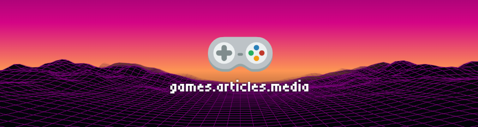

# Hello World!

Below is a preview of my work, for my full portfolio visit [joey.articles.media](https://joey.articles.media). I mainly work with React.js doing a mix of web and game development.

    
    
    
    
    
    
    
     
    
    
    
    
    
    
    
    
    
    
    
    
    
    
    
    

# Websites

[My Portfolio](https://portfolio.articles.media) - View my portfolio website.

[Games Portfolio](https://games.articles.media) - Portfolio that focuses just on the games I have developed. Also serves as a game launcher.

[Articles Media](https://articles.media) - Long time project of mine. Experimental news/political social media platform for all. 

[Articles Media Portfolio](https://articles.media/portfolio) - Portfolio related just to work done on Articles Media.

# Games

[🎮 Game Launcher \ Portfolio](https://games.articles.media) that showcases all the games better then a list can.

<b>Games preview, visit the above link for a full list. All games can be played in browser and include a mix of single player and multiplayer games. Multiplayer games use WebSockets or Peer-to-peer. Some games include playing over both server types.</b>

<!-- Do not edit here, auto generated from games.articles.media/api/games/articles-media/html-table (games-showcase) -->
<table width="100%"><tr><td align="center" width="33.33%"><b>Four Frogs</b> <a href="https://github.com/Articles-Joey/four-frogs">GitHub</a> • <a href="https://four-frogs.articles.media">Website</a></td><td align="center" width="33.33%"><b>Race Game</b> <a href="https://github.com/Articles-Joey/race-game">GitHub</a> • <a href="https://race-game.articles.media">Website</a></td><td align="center" width="33.33%"><b>Battle Trap</b> <a href="https://github.com/Articles-Joey/battle-trap">GitHub</a> • <a href="https://battle-trap.articles.media">Website</a></td></tr><tr><td align="center"><b>Plinko</b> <a href="https://github.com/Articles-Joey/plinko">GitHub</a> • <a href="https://plinko.articles.media">Website</a></td><td align="center"><b>Blackjack</b> <a href="https://github.com/Articles-Joey/blackjack">GitHub</a> • <a href="https://blackjack.articles.media">Website</a></td><td align="center"><b>Eager Eagle</b> <a href="https://github.com/Articles-Joey/eager-eagle">GitHub</a> • <a href="https://eager-eagle.articles.media">Website</a></td></tr><tr><td align="center"><b>Assets Gallery</b> <a href="https://github.com/Articles-Joey/assets-gallery">GitHub</a> • <a href="https://assets-gallery.articles.media">Website</a></td><td align="center"><b>Glass Ceiling</b> <a href="https://glass-ceiling.articles.media">Website</a></td><td align="center"><b>USA Tycoon</b> <a href="https://usa-tycoon.articles.media">Website</a></td></tr><tr><td align="center"><b>Carousel of Progress</b> <a href="https://github.com/Articles-Joey/carousel-of-progress">GitHub</a> • <a href="https://carousel-of-progress.articles.media">Website</a></td><td align="center"><b>Pinball</b> <a href="https://github.com/Articles-Joey/pinball">GitHub</a> • <a href="https://pinball.articles.media">Website</a></td><td align="center"><b>Ocean Rings</b> <a href="https://github.com/Articles-Joey/ocean-rings">GitHub</a> • <a href="https://ocean-rings.articles.media">Website</a></td></tr><tr><td align="center"><b>School Run</b> <a href="https://github.com/Articles-Joey/school-run">GitHub</a> • <a href="https://school-run.articles.media">Website</a></td><td align="center"><b>Move Match</b> <a href="https://github.com/Articles-Joey/move-match">GitHub</a> • <a href="https://move-match.articles.media">Website</a></td><td align="center"><b>Cannon</b> <a href="https://github.com/Articles-Joey/cannon">GitHub</a> • <a href="https://cannon.articles.media">Website</a></td></tr><tr><td align="center"><b>Death Race</b> <a href="https://github.com/Articles-Joey/death-race">GitHub</a> • <a href="https://death-race.articles.media">Website</a></td><td align="center"><b>Tag</b> <a href="https://github.com/Articles-Joey/tag">GitHub</a> • <a href="https://tag.articles.media">Website</a></td><td align="center"><b>Ice Slide</b> <a href="https://github.com/Articles-Joey/ice-slide">GitHub</a> • <a href="https://ice-slide.articles.media">Website</a></td></tr><tr><td align="center"><b>8 Ball Pool</b> <a href="https://github.com/Articles-Joey/8-ball-pool">GitHub</a> • <a href="https://8-ball-pool.articles.media">Website</a></td><td align="center"><b>Parkour</b> <a href="https://github.com/Articles-Joey/parkour">GitHub</a> • <a href="https://parkour.articles.media">Website</a></td><td align="center"><b>Tug of War</b> <a href="https://github.com/Articles-Joey/tug-of-war">GitHub</a> • <a href="https://tug-of-war.articles.media">Website</a></td></tr><tr><td align="center"><b>Platformer Escape</b> <a href="https://github.com/Articles-Joey/platformer-escape">GitHub</a> • <a href="https://platformer-escape.articles.media">Website</a></td><td align="center"><b>Jungle Vines</b> <a href="https://github.com/Articles-Joey/jungle-vines">GitHub</a> • <a href="https://jungle-vines.articles.media">Website</a></td><td align="center"><b>Treasure Dive</b> <a href="https://github.com/Articles-Joey/treasure-dive">GitHub</a> • <a href="https://treasure-dive.articles.media">Website</a></td></tr><tr><td align="center"><b>Memory Game</b> <a href="https://github.com/Articles-Joey/memory-game">GitHub</a> • <a href="https://memory-game.articles.media">Website</a></td><td align="center"><b>Catching Game</b> <a href="https://github.com/Articles-Joey/catching-game">GitHub</a> • <a href="https://catching-game.articles.media">Website</a></td><td align="center"><b>Stop the Thieves</b> <a href="https://github.com/Articles-Joey/stop-the-thiefs">GitHub</a> • <a href="https://stop-the-thieves.articles.media">Website</a></td></tr><tr><td align="center"><b>Assassin</b> <a href="https://github.com/Articles-Joey/assassin">GitHub</a> • <a href="https://assassin.articles.media">Website</a></td><td align="center"><b>Trash Chute</b> <a href="https://github.com/Articles-Joey/trash-chute">GitHub</a> • <a href="https://trash-chute.articles.media">Website</a></td><td align="center"><b>Spleef</b> <a href="https://github.com/Articles-Joey/spleef">GitHub</a> • <a href="https://spleef.articles.media">Website</a></td></tr></table>

# Software

Articles Project Manager (React / Node.js Web App) - [GitHub](https://github.com/Articles-Joey/articles-project-manager)

- Software to help bulk manage Node.js projects using NPM on a computer.

Articles Backups (React / Node.js Web App / Electron Windows App) - [GitHub](https://github.com/Articles-Joey/articles-backups)

- Software to assist in the manual and automatic backup and encryption of computer data.

# NPM Packages

Articles Dev Box - [NPM](https://www.npmjs.com/package/@articles-media/articles-dev-box) - [GitHub](https://github.com/Articles-Joey/articles-dev-box)

Articles Gamepad Keyboard - [NPM](https://www.npmjs.com/package/@articles-media/articles-gamepad-keyboard) - [GitHub](https://github.com/Articles-Joey/articles-gamepad-keyboard)

# Browser Extensions

Articles Media - [GitHub](https://github.com/Articles-Joey/articles-browser-extension-react) (Gotta build yourself for now, not on extension stores yet.)

# 3D Projects

Scoops Builder - [GitHub](https://github.com/Articles-Joey/scoops-builder) - [Website](https://scoops-builder.vercel.app/) - Website built with React-Three-Fiber that lets you customize an ice cream cone.

City Grid - [GitHub](https://github.com/Articles-Joey/city-grid) - [Website](https://city-grid.vercel.app/) - Website built with React-Three-Fiber that shows a city scene with adjustable size.